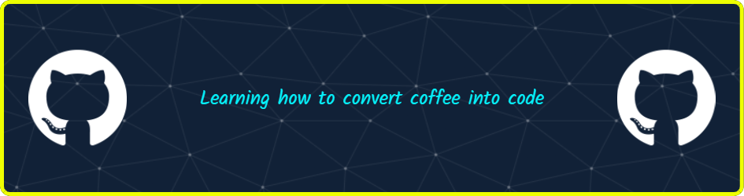

<h3 align="center">A passionate software engineer from India</h3>

  

  

  

- 📫 How to reach me **abhramondal9674@gmail.com**

- ⚡ Fun fact **I am interested in learning new technologies.**

<h3 align="left">Connect with me:</h3>

<h3 align="left">Languages and Tools:</h3>

   

&nbsp;

